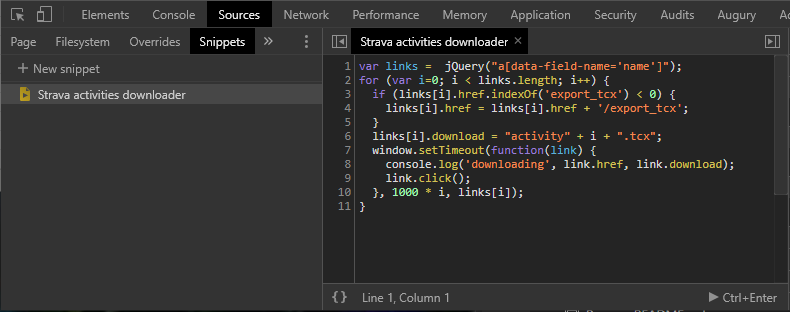

<h1>Catalog TCX</h1>

Organizes Garmin Track .tcx files into a catalog of folders.

* Files are renamed according to their internal activity date and time to comply with the format yyyymmdd_hhmm.tcx, making them easy to sort and find.
* The timestamp on the file is set to reflect the activity date and time.
* Files are stored in yearly folders (\2020, \2019, \2018, etc.) so they can be easily Zipped and archived.

Discovers Track files from:

1. The current folder
1. A connected Garmin device (USB)
1. Your Zwift user folder (MyDocuments\Zwift\Activities)

```
MyDocuments
  \2018
  \2019
     20191201_0813.tcx
     20191202_0504.tcx
     20191203_0522.tcx
     20191204_0617.tcx
  \2020
     20200101_1154.tcx
     20200102_1656.tcx
     20200104_1645.tcx
```

<h2>How to run</h2>

Download the latest release and copy to the folder of your choice and run the executable.

Or, download the source, compile with Visual Studio, VSCode, or the dotnet command line.

<h1>Download Individual Strava Activity as TCX File</h1>

Strava lets you download any activity as a .tcx simply by appending /export_tcx to the activity URL.

For example, given the activity URL:

    https://www.strava.com/activities/2590236689

Append /export_tcx to this to download its .tcx file:

    https://www.strava.com/activities/2590236689/export_tcx

<h1>Bulk Download Strava Activities as TCX Files</h1>

If you're tech-savvy (or just adventerous) then it is possible to download up to 20 activities at a time from the Strava activities page using the
Microsoft Edge or Google Chrome Web browser.

First, you'll need to create a new code Snippet in your browser. 

1. Open your browser and press F12. This will display the developer tools pannel.
2. Click the Sources tab
3. Click the Snippets tab
4. Click + New Snippet
5. Name the snippet "Strava activities downloader"
6. Paste the following code into the source code panel and press Ctrl-S to save it
```javascript
var links =  jQuery("a[data-field-name='name']");
for (var i=0; i < links.length; i++) {
  if (links[i].href.indexOf('export_tcx') < 0) {
    links[i].href = links[i].href + '/export_tcx';
  }
  links[i].download = "activity" + i + ".tcx";
  window.setTimeout(function(link) {
    console.log('downloading', link.href, link.download);
    link.click();
  }, 1000 * i, links[i]);
}
```


Navigate to your activities page. Enter any desired filters to find the data you want. Note that only 20 activities are displayed at a time so you need to run this multiple times if you want more data.

Press Ctrl-Enter (or click the >Ctrl+Enter link at the bottom of the source panel) to execute the snippet.

Each file will be downloaded, one per second so wait for them all to finish before moving on.

Move to the next page of activities and re-run script, repeat as necessary.
